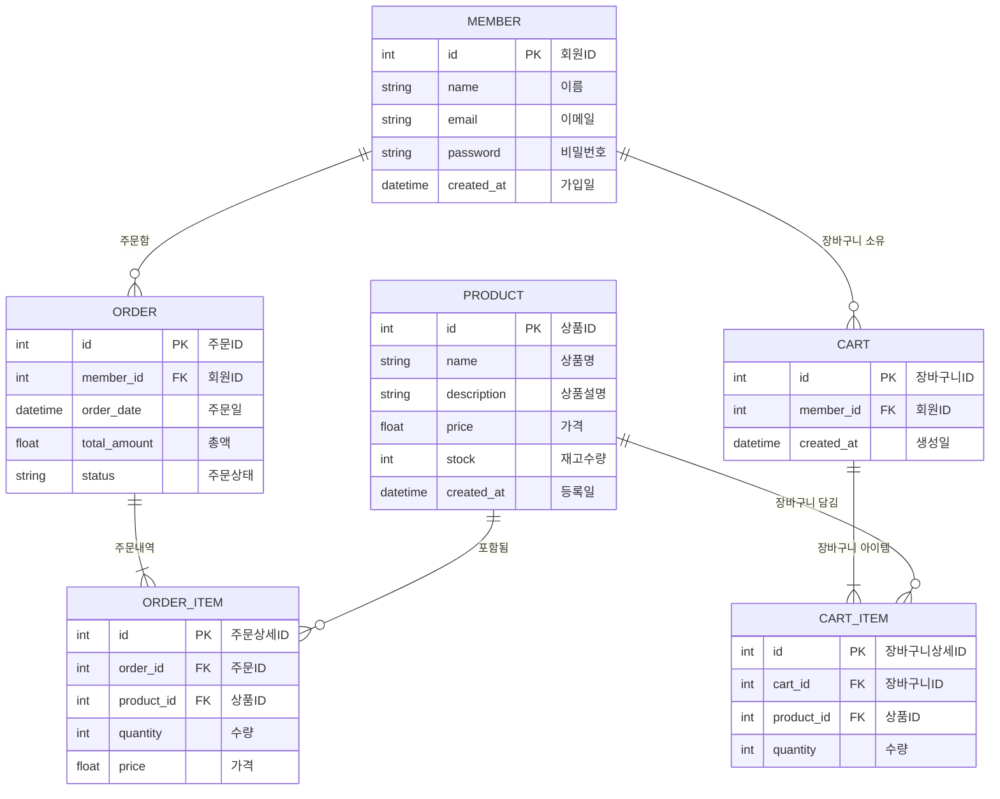

```mermaid
erDiagram
    %% 회원
    MEMBER {
        int id PK "회원ID"
        string name "이름"
        string email "이메일"
        string password "비밀번호"
        datetime created_at "가입일"
    }

    %% 상품
    PRODUCT {
        int id PK "상품ID"
        string name "상품명"
        string description "상품설명"
        float price "가격"
        int stock "재고수량"
        datetime created_at "등록일"
    }

    %% 주문
    ORDER {
        int id PK "주문ID"
        int member_id FK "회원ID"
        datetime order_date "주문일"
        float total_amount "총액"
        string status "주문상태"
    }

    %% 주문 상세
    ORDER_ITEM {
        int id PK "주문상세ID"
        int order_id FK "주문ID"
        int product_id FK "상품ID"
        int quantity "수량"
        float price "가격"
    }

    %% 장바구니
    CART {
        int id PK "장바구니ID"
        int member_id FK "회원ID"
        datetime created_at "생성일"
    }

    CART_ITEM {
        int id PK "장바구니상세ID"
        int cart_id FK "장바구니ID"
        int product_id FK "상품ID"
        int quantity "수량"
    }

    %% 관계
    MEMBER ||--o{ ORDER : "주문함"
    ORDER ||--|{ ORDER_ITEM : "주문내역"
    PRODUCT ||--o{ ORDER_ITEM : "포함됨"
    
    MEMBER ||--o{ CART : "장바구니 소유"
    CART ||--|{ CART_ITEM : "장바구니 아이템"
    PRODUCT ||--o{ CART_ITEM : "장바구니 담김"
```